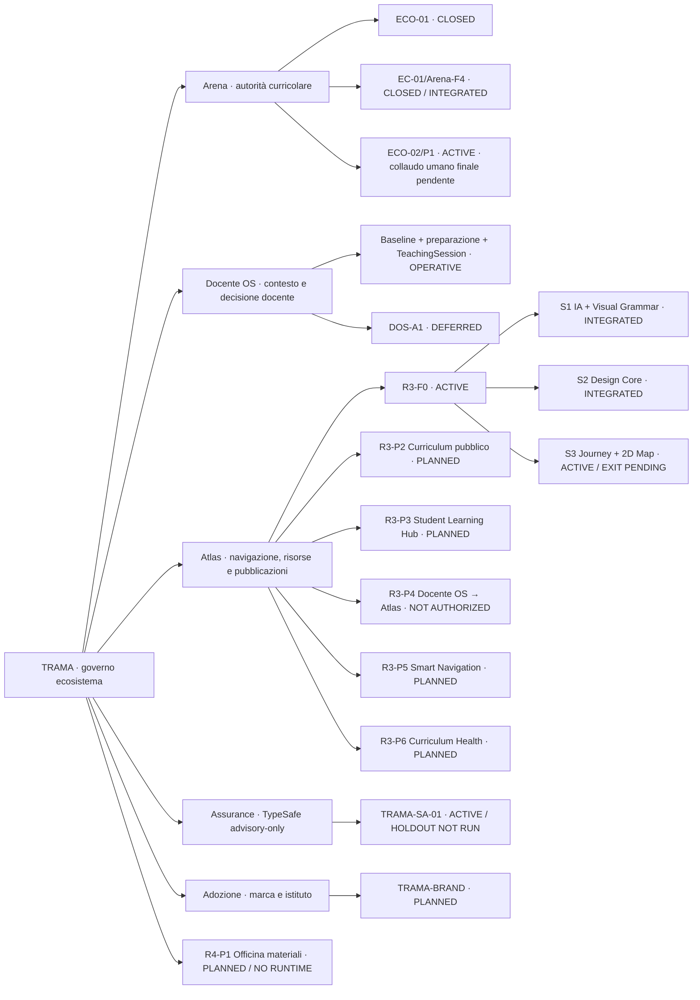

# Stato dell ecosistema TRAMA

Aggiornato al 22 settembre 2026.

## Mappa unica TRAMA — stato corrente

### Lettura operativa

| Livello | Stato | Significato |
| --- | --- | --- |
| Governo TRAMA | **STABILE** | Autorità, confini e contratti cross-product consolidati |
| Arena | **OPERATIVA** | Fonte curricolare autorevole; EC-01/Arena-F4 integrato |
| Docente OS | **OPERATIVO** | Preparazione, contesto, decisione docente e registrazione lezione disponibili |
| ECO-02/P1 | **ACTIVE** | È il principale gate reale ancora da chiudere: collaudo umano integrato Tecnologia 2C |
| Atlas R3-F0 | **ACTIVE** | Fondazione prodotto/design in avanzamento; S1/S2 integrati, S3 non ancora chiuso |
| Runtime Docente OS → Atlas | **NON AUTORIZZATO** | Nessuna pubblicazione automatica cross-product |
| Officina materiali | **PLANNED** | Architettura approvata; runtime ancora da progettare/autorizzare |
| DOS-A1 | **DEFERRED** | Nessuna automazione operativa autonoma autorizzata |
| TypeSafe | **ACTIVE / ADVISORY** | HOLDOUT one-shot non eseguito; nessun potere decisionale |
| Marca/adozione | **PLANNED** | Nome, posizionamento, protezione e pilota istituto ancora da svolgere |

### Priorità canonica corrente

1. **Chiudere ECO-02/P1** con un caso reale integrato Tecnologia 2C senza correzioni tecniche durante il percorso.
2. **Chiudere R3-F0/S3** con review visuale umana, tastiera, screen reader, reflow e non-text-contrast.
3. Solo dopo queste evidenze, decidere l'apertura dei successivi slice Atlas e di eventuali runtime cross-product.
4. Mantenere **DOS-A1 deferred**, Officina runtime non autorizzata e Atlas privacy-first.

| Area | Stato | Evidenza o prossimo controllo |
| --- | --- | --- |
| Curricolo governato | Operativo | Arena rimane la fonte autorevole |
| Educazione civica / EC-01 | Governance approvata / implementazione separata | contratto primo ciclo approvato; Arena = quadro approvato, Docente OS = attuazione, Atlas = consultazione; nessuna autorizzazione runtime |
| EC-01/Arena-F4 | **Integrato** | trusted normative checker integrato in Arena su merge `f0cc66a4795af90e85eacf5f32b5a91e88c7c1d8`; Edge Function validata ma non deployata; nessun fingerprint reale seedato automaticamente |
| ECO-01 | Chiuso | forma docente e contratti cross-product validati |
| ECO-02/P1 | Pilota controllato attivo | percorso reale Arena → Docente OS consolidato fino a P9; registrazione lezione verificata in Beta; collaudo umano integrato finale ancora pendente |
| Atlas / R3 | R3-F0 attivo | ADR-007/008/010 approvate; Product & Design Foundation approvata e integrata; avvio consentito entro i confini NO_RUNTIME e privacy-first |
| Docente OS | Operativo nel proprio dominio | baseline persistente, preparazione, proposte teacher-editable, registrazione lezione e runtime release contract verificati |
| Officina materiali / R4-P1 | Architettura approvata / runtime non autorizzato | separazione tra regia didattica e produzione specialistica approvata da ADR-010; implementazione ancora da progettare |
| TRAMA-SA-01 | Pilota assurance attivo | gate R3B HOLDOUT one-shot integrato; HOLDOUT non eseguito; TypeSafe resta advisory-only |
| DOS-A1 | RUNTIME_DEFERRED | richiede una nuova autorizzazione esplicita; nessuna evidenza corrente lo attiva implicitamente |
| Marca TRAMA | Nome di lavoro | verifiche giuridiche, digitali e di posizionamento ancora pendenti |

## ECO-02/P1 — stato reale consolidato

Il pilota resta **ACTIVE**. Non viene chiuso automaticamente dall'avanzamento tecnico.

Sono già recepiti o verificati:

- autorizzazione del pilota Tecnologia 2C;
- baseline curricolare Arena persistente per classe + disciplina + anno scolastico + versione;
- gate docente esplicito e confini di autorità server-side;
- accesso stabile «Prima della lezione»;
- proposta didattica P9 modificabile, sostituibile o escludibile e separata dall'adozione;
- registrazione di una TeachingSession in Beta con receipt di registrazione ed evidenza TE-1A;
- separazione tra minuti registrati e decisione docente sul completamento del blocco;
- Runtime Release Contract in Docente OS con replay DB selettivo, schema watermark, fail-fast e Runtime Health;
- trasferimento manuale .cml-handoff.json mantenuto soltanto come interoperabilità, pilota o ripiego.

Il fatto che singoli sottoflussi siano stati verificati non equivale ancora al collaudo umano finale del pilota 2C.

Il runbook canonico del collaudo finale è ora integrato e richiede una prova reale senza interventi tecnici correttivi durante il percorso.

## Gate residuo per chiudere ECO-02/P1

Prima della chiusura devono risultare insieme, nello **stesso caso reale integrato**:

1. lezione pilota 2C identificata con data e collocazione coerente nel dominio Docente OS;
2. decisione docente registrata sulla risorsa Atlas proposta: riutilizzo, adattamento, sostituzione o esclusione;
3. verifica mobile P9 della singola superficie di proposta, modifica esplicita e nuova conferma dopo una modifica;
4. percorso completo preparazione → decisione materiali → uso → registrazione lezione senza interventi tecnici correttivi durante il test;
5. rapporto umano finale su comprensibilità, tempo, controllo, qualità didattica e criticità residue.

La chiusura del pilota non autorizza DOS-A1.

## Educazione civica — modello approvato

TRAMA-ADR-011 è approvata con contratto canonico `docs/contracts/educazione-civica-primo-ciclo.md`.

Confini proposti:

- Arena: quadro annuale approvato, quote annuali, nuclei/obiettivi, fonti normative e versioni;
- Docente OS: progettazione di classe, conferma delle ore svolte, attività interdisciplinari condivise, consuntivo e monitoraggio;
- Atlas: sola consultazione/navigazione del quadro approvato;
- primaria e secondaria di primo grado: minimo complessivo di 33 ore annue, senza trasformarlo in quota settimanale per disciplina;
- infanzia: documentazione di esperienze e ambiti di cittadinanza, senza conteggio delle 33 ore;
- attività condivise: nate dalla progettazione di classe, conteggiate una sola volta nel totale e mantenute separate dalle quote proprie delle discipline;
- nessun dato di attuazione ritorna ad Arena o Atlas.

Il contratto è **APPROVED_GOVERNANCE / NO_RUNTIME_AUTHORIZATION**. Le implementazioni restano separate e richiedono i rispettivi gate exact-head.

## Atlas — prossimo cantiere principale

La governance di base è già consolidata:

- Arena resta l'autorità curricolare;
- Atlas è autorevole per identità/versione/stato delle proprie risorse, pagine e pubblicazioni;
- Docente OS resta l'autorità del contesto professionale e della decisione docente;
- LessonPublicationManifest e PublicationReceipt restano distinti;
- il runtime Docente OS → Atlas resta NOT_IMPLEMENTED / NOT_AUTHORIZED_FOR_RUNTIME.

**TRAMA-ADR-010 — Atlas integrale e Officina materiali** è approvata e integrata. **R3-F0 — Product & Design Foundation** è approvato, integrato e `ACTIVE` come slice di prodotto/design. Il primo incremento **R3-F0/S1 — Information Architecture + Visual Grammar** è approvato con HUMAN EXACT-HEAD REVIEW PASS e integrato su `main`; resta `NO_RUNTIME`. Il secondo incremento **R3-F0/S2 — Design Core & Accessible Primitives** è approvato con HUMAN EXACT-HEAD REVIEW PASS e integrato su `main`; resta `NO_RUNTIME`. Il pacchetto statico del terzo incremento **R3-F0/S3 — Journey Prototypes & 2D Map POC** è approvato con HUMAN EXACT-HEAD REVIEW PASS e integrato su `main`; resta `NO_RUNTIME`. S3 non è ancora chiuso. Il pacchetto **R3-F0/S3-V1 — Rendered Prototype Validation** è approvato con HUMAN EXACT-HEAD REVIEW PASS e integrato su `main` all'exact head `5e1a6feb1d3a4ae08f3547841e7ceef20e37bed6` (merge commit `4e34b363b2969051ff8dce4a7ee5a88d09b400a7`). Il prototipo HTML/CSS con JavaScript locale minimale resta `NO_RUNTIME`; contratto statico, test e browser rendering automatizzato Android-like/desktop/LIM sono PASS. Restano PENDING review visuale umana, walkthrough tastiera, screen reader e reflow/non-text-contrast completi. Restano esclusi runtime cross-product, autenticazione/account studenti, profili o tracking individuale, Officina runtime e DOS-A1.

## TypeSafe — assurance separata dal prodotto

TRAMA-SA-01 resta un pilota di assurance **advisory-only**. Non crea autorità e non autorizza scritture.

Il gate R3B HOLDOUT one-shot è ora integrato con:
- dispatch solo da main;
- pin dei contenuti sperimentali;
- concurrency serializzata;
- marker durevole di consumo;
- conservazione dell'artefatto anche su provider error.

Il merge del gate non ha eseguito il HOLDOUT. Qualunque dispatch resta un'azione esplicita separata e non promuove TRAMA-ADR-009.

TypeSafe non blocca l'avvio di R3-F0 Atlas.

## Semaforo di ecosistema

- **Verde**: governo delle autorità, baseline Arena, controllo docente, contratti di pubblicazione, hardening runtime Docente OS.
- **Giallo**: chiusura ECO-02/P1, Atlas Product Foundation, Officina materiali, TypeSafe HOLDOUT, marca e adozione.
- **Rosso / escluso dall'architettura**: autenticazione/account studente, profili o tracking individuale in Atlas. **Rosso / non autorizzato**: adozione o pubblicazione autonoma, DOS-A1, esiti individuali verso Atlas.

## Vincoli attivi

1. Arena resta la fonte curricolare di Docente OS anche quando Atlas pubblica una proiezione del medesimo curricolo.
2. Le risorse Atlas sono proposte modificabili, sostituibili o escludibili.
3. Classe, calendario, preparazione, diario e decisioni professionali restano nel dominio Docente OS.
4. Una baseline curricolare è persistente per classe, disciplina, anno e versione; non deve essere trasferita manualmente a ogni lezione.
5. Trasporto, persistenza e pubblicazione non equivalgono ad approvazione istituzionale.
6. Atlas non richiede né mantiene autenticazione, account, profili, tracking o dati personali individuali degli studenti.
7. Drive non è una memoria tecnica concorrente.
8. Ogni capacità runtime nuova richiede il proprio gate, evidenza e review exact-head.
9. Educazione civica non deve essere modellata come quota settimanale locale per disciplina: il quadro annuale approvato appartiene ad Arena e l'attuazione reale appartiene a Docente OS.
