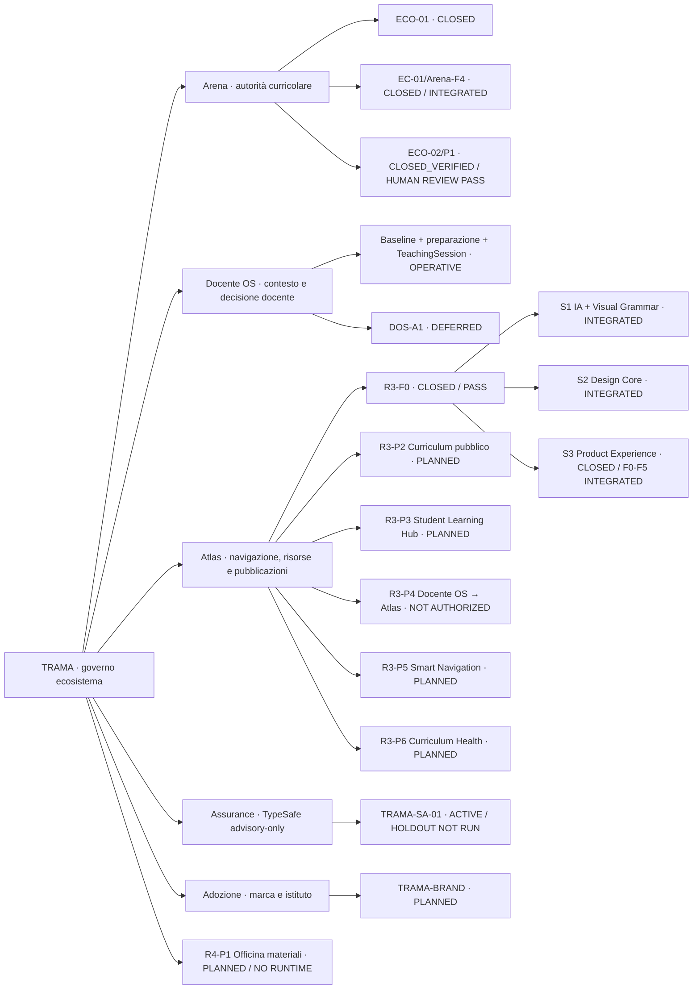

# Stato dell ecosistema TRAMA

Aggiornato al 4 ottobre 2026.

Riferimento trasversale di completamento: [`docs/audits/TRAMA-AUDIT-2026-10-03.md`](docs/audits/TRAMA-AUDIT-2026-10-03.md), **v1.1 / delta verificato 04-10-2026**.

Stato operativo del piano di chiusura:
- **P1 Orario + PWA + Android:** cantiere applicativo chiuso e beta consolidata; installazione nativa Chrome/Android resta residuo di qualification non bloccante;
- **P2 Arena→Atlas:** VERIFIED / INTEGRATED; run schedulati del sync PASS con validation e no-op governato;
- **P3 evidenze/distribuzioni:** **CLOSED / BASELINE_RECONCILED**; stato canonico, Project Knowledge persistente, Control Center e distribuzioni sono riconciliati; QE-01, Argo G5-C e gh-aw T0 restano residui separati P5/P4/P6.

## Mappa unica TRAMA — stato corrente

```mermaid
flowchart LR
  TRAMA["TRAMA · governo ecosistema"]

  TRAMA --> ARENA["Arena · autorità curricolare"]
  TRAMA --> DOS["Docente OS · contesto e decisione docente"]
  TRAMA --> ATLAS["Atlas · navigazione, risorse e pubblicazioni"]
  TRAMA --> ASSURANCE["Assurance · TypeSafe advisory-only"]
  TRAMA --> BRAND["Adozione · marca e istituto"]

  ARENA --> ECO01["ECO-01 · CLOSED"]
  ARENA --> ECF4["EC-01/Arena-F4 · CLOSED / INTEGRATED"]
  ARENA --> ECO02["ECO-02/P1 · CLOSED_VERIFIED / HUMAN REVIEW PASS"]

  DOS --> DOSBASE["Baseline + preparazione + TeachingSession · OPERATIVE"]
  DOS --> DOSA1["DOS-A1 · DEFERRED"]

  ATLAS --> R3F0["R3-F0 · CLOSED / PASS"]
  R3F0 --> S1["S1 IA + Visual Grammar · INTEGRATED"]
  R3F0 --> S2["S2 Design Core · INTEGRATED"]
  R3F0 --> S3["S3 Product Experience · CLOSED / F0-F5 INTEGRATED"]
  ATLAS --> R3P2["R3-P2 Curriculum pubblico · PLANNED"]
  ATLAS --> R3P3["R3-P3 Student Learning Hub · PLANNED"]
  ATLAS --> R3P4["R3-P4 Docente OS → Atlas · NOT AUTHORIZED"]
  ATLAS --> R3P5["R3-P5 Smart Navigation · PLANNED"]
  ATLAS --> R3P6["R3-P6 Curriculum Health · PLANNED"]

  TRAMA --> R4P1["R4-P1 Officina materiali · PLANNED / NO RUNTIME"]
  ASSURANCE --> TSA["TRAMA-SA-01 · ACTIVE / HOLDOUT NOT RUN"]
  BRAND --> TB["TRAMA-BRAND · PLANNED"]
```

### Lettura operativa

| Livello | Stato | Significato |
| --- | --- | --- |
| Governo TRAMA | **STABILE** | Autorità, confini e contratti cross-product consolidati; TRAMA-PW-01 integrato; baseline documentale ecosistema integrata via PR #62 |
| Arena | **OPERATIVA** | Fonte curricolare autorevole; EC-01/Arena-F4 integrato |
| Docente OS | **OPERATIVO / BETA CONSOLIDATA** | `develop@09a3a3600b81992f3675be82d1d2f188f1643909`; Orario manuale verificato su Android/Beta; PWA e Share Target applicativamente qualificate; residuo installazione nativa browser/device non bloccante |
| ECO-02/P1 | **CLOSED_VERIFIED / HUMAN REVIEW PASS** | Collaudo reale Tecnologia 2C chiuso; nessuna autorizzazione implicita a DOS-A1 |
| Arena→Atlas sync | **VERIFIED / INTEGRATED** | Atlas `main@b7b95e81e896a027335b3398d222660aa81f928a`; run `37214517566` PASS: fetch/validate, change detection e no-op governato quando il curricolo è già corrente |
| Atlas R3-F0 | **CLOSED / HUMAN REVIEW PASS** | S3-V2 F0-F5 integrata; F4 Mobile+LIM e F5 Exit PASS su exact head `bc11577eeeeeed9c43ad62ac43fb7561e1197246`, merge Atlas #32 `423444be9dd883f4c35c6c1c89e94f6b0e5405fa` |
| Runtime Docente OS → Atlas | **NON AUTORIZZATO** | Nessuna pubblicazione automatica cross-product |
| Officina materiali | **PLANNED** | Architettura approvata; runtime ancora da progettare/autorizzare |
| DOS-A1 | **DEFERRED** | Nessuna automazione operativa autonoma autorizzata |
| TypeSafe | **ACTIVE / ADVISORY** | HOLDOUT one-shot non eseguito; nessun potere decisionale |
| Marca/adozione | **PLANNED** | Nome, posizionamento, protezione e pilota istituto ancora da svolgere |
| TRAMA Control Center v2 | **CC2-F0–F6 INTEGRATED** | Primo ciclo Control Center v2 integrato: snapshot/evidence, Home, Stakeholder Assurance, mobile-first, Project Knowledge, Penpot tooling/design system, Capability + Ecosystem Map, Evidence Explorer + Integrity, Timeline + Operational Path. ADR-015 resta PROPOSED. |
| TRAMA Governed Forecast / CC3 | **CC3-F0 CLOSED / CC3-F1 CLOSED** | F0 e F1 hanno HUMAN EXACT-HEAD REVIEW PASS. F2–F5 restano pianificati; nessuna probability/score, ranking, auto-promotion, authority o runtime authorization. ADR-016 resta PROPOSED. |

## OR-07 → OR-10 — capability condivise, portabilità e integrazioni prodotto

Stato corrente: **CLOSED / HUMAN REVIEW PASS / INTEGRATED / NO_RUNTIME**.

Il pacchetto governato OR-07→OR-10 è stato integrato tramite Human Review finale **#210**, merge TRAMA:

`6c61e001992c2696496cddee00d668abf2da7fe3`

Sono integrati:

- **OR-07 — Shared Capability Layer**: contratto provider-neutral e proof offline deterministico;
- **OR-08 — Runtime Portability**: stessa capability/request contract su adapter distinti, qualifica `PORTABLE_CONTRACT`;
- **OR-09 — Qualified Execution Readiness**: readiness pre-autorizzativa, stato massimo `AWAITING_HUMAN_AUTHORIZATION`;
- **OR-10 — Product Integrations**: confini Arena/Atlas/Docente OS e allineamento cross-product delle evidenze.

Slice prodotto integrate:
- Arena #345 → `7d0e9d1e30af25e29b5a3366d0570f149c17a6f4`;
- Docente OS #645 → `97580b1b0b6bc024690275bb227c6551e30d6341`;
- Atlas #66 → `db3fed294fe7695b33042192fd4551d6d36bdc68`.

Invarianti confermate:
- Arena resta autorità curricolare;
- Atlas resta opzionale e non-authority curricolare;
- Docente OS resta teacher-first;
- Shared Capability Layer non è un domain store né una nuova authority;
- Control Center resta READ_ONLY;
- nessun runtime live, rete, secret usage o capability mutativa è autorizzato;
- `DOS-A1 = RUNTIME_DEFERRED`.

Il filone OR non ha ulteriori slice automatiche. Qualunque passaggio a esecuzione reale richiede un nuovo dossier e una nuova Human Review separata.

## TRAMA Control Center v2 — maturità, evidenze e project knowledge

Il Control Center v2 è operativo come osservatorio **snapshot-first, read-only e senza overall score**.

Stato integrato corrente:

- **CC2-F0** baseline di maturità/evidenze — #65, merge `d23e6f8443ab6b7316696809327aba8249e6b01a`;
- **CC2-F1/A–D** snapshot, maturity definitions, wiring conservativo, evidence binding e freshness — #66–#69;
- **CC2-F2** Snapshot-first Home — #71;
- **CC2-F3A** Stakeholder Assurance Model — #72;
- **CC2-F3B** Stakeholder Summary, Contextual Help & Living Dossier — #73;
- **CC2-F3C** Mobile-first Control Center — #74;
- hardening mobile strutturale/PWA/overflow — #75, #76, #77;
- mobile carousel polish — #80, merge `95e68b88b18d4d9b7ed2a98984a4f18ed14e8ca0`;
- **CC2-F1/E Project Knowledge & Agent Context** — #81, merge `4a17766bc315340824b4ef44204f81a1487515ce`;
- Penpot MCP pilot — #82, merge `262b7e4c8b908f4d3c39e2469c0e9d34e03a4e25`;
- TRAMA Penpot design system — #83, merge `5cfb09f94ea532dc1f64523f7e10da6629159843`;
- **CC2-F4 Capability + Ecosystem Map** — #84, merge `93a3fadf78732979c4536cbb394744b9471e14da`;
- **CC2-F5 Evidence Explorer + Integrity** — #85, merge `21c43b3e092c3dc31e450d2c9b2e3bf24b8238fd`;
- **CC2-F6 Timeline + Operational Path** — #86, merge `f3c4396a620e2b4c51beb3f2616ebeebf82a6342`; HUMAN exact-head review PASS.

Restano invarianti:
- il Control Center non approva, non promuove e non autorizza runtime;
- `STATUS.md` e `ROADMAP.md` restano fonti canoniche di stato e sequenza;
- evidenza automatica, assessment indipendente e certificazione formale restano distinti;
- nessun claim di compliance generale o certificazione è derivato automaticamente.

### CC2-F1/E — Project Knowledge & Agent Context

La precedente PR #70 resta solo **salvage source**. La foundation recuperata è stata integrata tramite **#81** sulla baseline aggiornata, senza importare copie stale di `STATUS` o `ROADMAP`.

Sono integrati come foundation governata, con ADR-015 ancora PROPOSED:
- Project Knowledge & Agent Context Architecture v1;
- `ProjectContextSnapshot v1`;
- `TRAMA Context Pack v1`;
- `TRAMA-ADR-015` — **PROPOSED**;
- registrazione della proiezione `project-knowledge-projection`.

Vincoli: `READ_ONLY`, source-bound, version-bound quando pertinente, freshness-aware, no synthetic authority, retention della negative knowledge, rationale preservation, nessuna auto-promotion e nessuna autorizzazione runtime. `DOS-A1` resta `RUNTIME_DEFERRED`.

## Baseline documentale dell’ecosistema — integrata

La PR **#62 — TRAMA ecosystem baseline — vision, architecture and assets** è stata integrata su `main` con merge commit:

`fa596cd78e046fcfb0be1fb2fed5781b9199d8e2`

Exact head sottoposto a review:

`cee3e604dd9c406dbba902bad4cf49eb8fe0c8db`

Sono ora parte del repository:

- `docs/vision/TRAMA-ECOSYSTEM-BASELINE-2026-09-23.md` — baseline di sintesi e indice trasversale;
- `docs/product/TRAMA-PROJECT-PAGE.md` — pagina di progetto canonica;
- `docs/process/trama-documentation-maintenance-plan-2026-09-23.md` — piano di manutenzione documentale.

La baseline **non modifica la sequenza operativa** e non sostituisce le fonti già autorevoli. Restano in vigore le precedenze dichiarate:

1. ADR e contratti approvati — decisioni normative;
2. `STATUS.md` — stato corrente;
3. Piano operativo atomico — priorità e sequenza operativa;
4. specifiche integrate — comportamento del relativo dominio;
5. Filosofia in sviluppo — razionale e ipotesi;
6. baseline ecosistema — sintesi e indice;
7. dossier e asset visuali — supporto non normativo.

L’integrazione non autorizza R3-P4, DOS-A1, pubblicazione automatica o altri runtime cross-product.

### Priorità canonica corrente

La sequenza operativa è ora definita nel [Piano operativo atomico](docs/strategy/atomic-operating-plan-2026-09-22.md).

1. **R3-P2 — Curriculum pubblico** come prossimo incremento Atlas, ora che ECO-02/P1 e R3-F0 sono chiusi e verificati.
2. **R3-P5 — Smart Navigation / Percorsi** mantenendo separata la promozione runtime dalla presenza di prototipi governati.
3. **Ridurre l'attrito del percorso docente** mantenendo Arena → Docente OS diretto e Atlas opzionale, non obbligatorio.
4. **R4-P1 — Officina materiali** soltanto dopo evidenze e gate dedicati; R4-P2/S1 può proseguire NO_RUNTIME.
5. **R3-P3 — Learning Hub**; successivamente R3-P4 solo con nuova autorizzazione umana/runtime e R3-P6.
6. **R5 — adozione** con nome/marca, privacy dossier, assistenza, costi e pilota d'istituto.
7. Mantenere **DOS-A1 deferred**, pubblicazione autonoma non autorizzata e Atlas privacy-first.

| Area | Stato | Evidenza o prossimo controllo |
| --- | --- | --- |
| Curricolo governato | Operativo | Arena rimane la fonte autorevole |
| Educazione civica / EC-01 | Governance approvata / implementazione separata | contratto primo ciclo approvato; Arena = quadro approvato, Docente OS = attuazione, Atlas = consultazione; nessuna autorizzazione runtime |
| EC-01/Arena-F4 | **Integrato** | trusted normative checker integrato in Arena su merge `f0cc66a4795af90e85eacf5f32b5a91e88c7c1d8`; Edge Function validata ma non deployata; nessun fingerprint reale seedato automaticamente |
| ECO-01 | Chiuso | forma docente e contratti cross-product validati |
| ECO-02/P1 | **CLOSED_VERIFIED / HUMAN REVIEW PASS** | caso reale integrato Tecnologia 2C chiuso con receipt finale; DOS-A1 resta deferred |
| Atlas / R3 | **R3-F0 / S3-V2 CLOSED** | F0–F5 integrati e validati in Curriculum-Atlas; HUMAN EXACT-HEAD REVIEW PASS; NO cross-product runtime |
| Docente OS | Operativo nel proprio dominio | baseline persistente, preparazione, proposte teacher-editable, registrazione lezione e runtime release contract verificati |
| Officina materiali / R4-P1 | Architettura approvata / runtime non autorizzato | separazione tra regia didattica e produzione specialistica approvata da ADR-010; implementazione ancora da progettare |
| TRAMA-PW-01 | **Integrato / canary Docente OS PASS** | contratto trasversale no-silent-write integrato; Product CI, P6 Performance Runtime e HVA Runtime PASS sul Beta Docente OS dopo il merge applicativo |
| TRAMA-SA-01 | Pilota assurance attivo | gate R3B HOLDOUT one-shot integrato; HOLDOUT non eseguito; TypeSafe resta advisory-only |
| DOS-A1 | RUNTIME_DEFERRED | richiede una nuova autorizzazione esplicita; nessuna evidenza corrente lo attiva implicitamente |
| Marca TRAMA | Nome di lavoro | verifiche giuridiche, digitali e di posizionamento ancora pendenti |

## CC3 — Governed Forecast & Readiness

CC3 è la nuova fase governata del Control Center successiva alla chiusura di CC2-F0–F6.

Stato corrente: **CC3-F0 CLOSED / HUMAN EXACT-HEAD REVIEW PASS; CC3-F1 CLOSED / HUMAN EXACT-HEAD REVIEW PASS**.

CC3-F0 introduce soltanto contratto e guardrail:

- forecast derivato e source-bound, mai stato canonico;
- confidence esclusivamente `LOW | MEDIUM | HIGH`;
- rationale e invalidators obbligatori;
- scenario read-only e controfattuale;
- ForecastReceipt previsto per calibrazione futura;
- probabilità numeriche e score vietati fino a calibrazione e nuova decisione TRAMA;
- nessuna mutazione di capability, gate o maturity;
- nessuna authority, write cross-product o runtime authorization;
- DOS-A1 resta `RUNTIME_DEFERRED`.

Gate F0: **GATE-CC3-F0-HUMAN — PASS**.

**CC3-F1 — Next Transition Engine** è chiuso con HUMAN EXACT-HEAD REVIEW PASS. Deriva in modo deterministico transizioni possibili esclusivamente da gate, dipendenze e stato governato già presenti nello snapshot. Non predice quale esito si verificherà, non assegna probabilità o priorità e non modifica alcuna fonte canonica. **GATE-CC3-F1-HUMAN — PASS**.

F2–F5 restano PLANNED.

## ECO-02/P1 — stato reale consolidato

Il pilota è **CLOSED_VERIFIED / HUMAN REVIEW PASS**. La chiusura deriva dalla prova reale e dalla decisione umana finale, non dal solo avanzamento tecnico.

Sono già recepiti o verificati:

- autorizzazione del pilota Tecnologia 2C;
- baseline curricolare Arena persistente per classe + disciplina + anno scolastico + versione;
- gate docente esplicito e confini di autorità server-side;
- accesso stabile «Prima della lezione»;
- proposta didattica P9 modificabile, sostituibile o escludibile e separata dall'adozione;
- registrazione di una TeachingSession in Beta con receipt di registrazione ed evidenza TE-1A;
- separazione tra minuti registrati e decisione docente sul completamento del blocco;
- Runtime Release Contract in Docente OS con replay DB selettivo, schema watermark, fail-fast e Runtime Health;
- trasferimento manuale .cml-handoff.json mantenuto soltanto come interoperabilità, pilota o ripiego.

La prova integrata finale è stata completata e registrata nella receipt `docs/pilots/ECO-02-P1-FINAL-HUMAN-ACCEPTANCE-2026-09-25.md`.

## Evidenze di chiusura ECO-02/P1 — soddisfatte

Nello stesso caso reale integrato sono state verificate:

1. collocazione della lezione nel dominio Docente OS;
2. decisione docente sulle risorse proposte;
3. uso mobile delle superfici di proposta e modifica;
4. percorso preparazione → decisione materiali → uso → registrazione lezione;
5. rapporto umano finale e chiusura del blocker sull'apertura dei materiali.

Esito: **CLOSED_VERIFIED / HUMAN REVIEW PASS**.

La chiusura del pilota non autorizza DOS-A1.

## Educazione civica — modello approvato

TRAMA-ADR-011 è approvata con contratto canonico `docs/contracts/educazione-civica-primo-ciclo.md`.

Confini proposti:

- Arena: quadro annuale approvato, quote annuali, nuclei/obiettivi, fonti normative e versioni;
- Docente OS: progettazione di classe, conferma delle ore svolte, attività interdisciplinari condivise, consuntivo e monitoraggio;
- Atlas: sola consultazione/navigazione del quadro approvato;
- primaria e secondaria di primo grado: minimo complessivo di 33 ore annue, senza trasformarlo in quota settimanale per disciplina;
- infanzia: documentazione di esperienze e ambiti di cittadinanza, senza conteggio delle 33 ore;
- attività condivise: nate dalla progettazione di classe, conteggiate una sola volta nel totale e mantenute separate dalle quote proprie delle discipline;
- nessun dato di attuazione ritorna ad Arena o Atlas.

Il contratto è **APPROVED_GOVERNANCE / NO_RUNTIME_AUTHORIZATION**. Le implementazioni restano separate e richiedono i rispettivi gate exact-head.

## Atlas — prossimo cantiere principale

La governance di base è già consolidata:

- Arena resta l'autorità curricolare;
- Atlas è autorevole per identità/versione/stato delle proprie risorse, pagine e pubblicazioni;
- Docente OS resta l'autorità del contesto professionale e della decisione docente;
- LessonPublicationManifest e PublicationReceipt restano distinti;
- il runtime Docente OS → Atlas resta NOT_IMPLEMENTED / NOT_AUTHORIZED_FOR_RUNTIME.

**TRAMA-ADR-010 — Atlas integrale e Officina materiali** è approvata e integrata. **R3-F0 — Product & Design Foundation** è `CLOSED / HUMAN REVIEW PASS` dopo la chiusura verificata di S3-V2. Il primo incremento **R3-F0/S1 — Information Architecture + Visual Grammar** è approvato con HUMAN EXACT-HEAD REVIEW PASS e integrato su `main`; resta `NO_RUNTIME`. Il secondo incremento **R3-F0/S2 — Design Core & Accessible Primitives** è approvato con HUMAN EXACT-HEAD REVIEW PASS e integrato su `main`; resta `NO_RUNTIME`. Il pacchetto statico del terzo incremento **R3-F0/S3 — Journey Prototypes & 2D Map POC** è approvato con HUMAN EXACT-HEAD REVIEW PASS e integrato su `main`; resta `NO_RUNTIME`. S3 è chiuso con HUMAN EXACT-HEAD REVIEW PASS. Il pacchetto **R3-F0/S3-V1 — Rendered Prototype Validation** è approvato con HUMAN EXACT-HEAD REVIEW PASS e integrato su `main` all'exact head `5e1a6feb1d3a4ae08f3547841e7ceef20e37bed6` (merge commit `4e34b363b2969051ff8dce4a7ee5a88d09b400a7`). Il prototipo HTML/CSS con JavaScript locale minimale resta `NO_RUNTIME`; contratto statico, test e browser rendering automatizzato Android-like/desktop/LIM sono PASS. La HUMAN PRODUCT REVIEW successiva ha rilevato un mismatch sostanziale con la Product & Design Foundation: S3-V1 resta quindi harness tecnico/accessibilità e non può chiudere S3. **R3-F0/S3-V2 — Atlas Product Experience Prototype** è chiuso e integrato. Sono integrati in `Curriculum-Atlas`: **F0 Foundation** (merge `68ba12e06cddd781c28d38e8cd5eab24216ed9fb`), **F1 Curricolo verticale d’istituto + Materiali pubblici di base** (merge `ec0c2e0c89e7d1ac56c3cfb3b00ca66a3f51f869`) e **F2 Esplora relazionale** (merge `973429968d480eeeaf31362a9c6da7f18fed50e3`). F2 usa XYFlow/React Flow, zoom semantico, filtri, pannello contestuale e modalità Mappa/Elenco equivalente con layout mobile dedicato; i gate Foundation, Perceptible Write, F1 Visual Evidence e F2 Visual Evidence sono PASS sull’exact head di integrazione. **F3 Materiali+Risorse è integrato** in Curriculum-Atlas con merge `2a0f88b64e5002197cceeb2f82b06a5efd1edaee`. **F4 Mobile+LIM e F5 Exit sono integrati e PASS** sulla baseline finale Atlas #32. Restano esclusi runtime cross-product, autenticazione/account studenti, profili o tracking individuale, Officina runtime e DOS-A1.

## TypeSafe — assurance separata dal prodotto

TRAMA-SA-01 resta un pilota di assurance **advisory-only**. Non crea autorità e non autorizza scritture.

Il gate R3B HOLDOUT one-shot è ora integrato con:
- dispatch solo da main;
- pin dei contenuti sperimentali;
- concurrency serializzata;
- marker durevole di consumo;
- conservazione dell'artefatto anche su provider error.

Il merge del gate non ha eseguito il HOLDOUT. Qualunque dispatch resta un'azione esplicita separata e non promuove TRAMA-ADR-009.

TypeSafe non blocca l'avvio di R3-F0 Atlas.

## Semaforo di ecosistema

- **Verde**: governo delle autorità, baseline Arena, controllo docente, contratti di pubblicazione, hardening runtime Docente OS.
- **Giallo**: Officina materiali, TypeSafe HOLDOUT, binding completo delle evidenze di maturità, marca e adozione. ECO-02/P1 e R3-F0 Atlas Product Foundation sono chiusi.
- **Rosso / escluso dall'architettura**: autenticazione/account studente, profili o tracking individuale in Atlas. **Rosso / non autorizzato**: adozione o pubblicazione autonoma, DOS-A1, esiti individuali verso Atlas.

## Vincoli attivi

1. Arena resta la fonte curricolare di Docente OS anche quando Atlas pubblica una proiezione del medesimo curricolo.
2. Le risorse Atlas sono proposte modificabili, sostituibili o escludibili.
3. Classe, calendario, preparazione, diario e decisioni professionali restano nel dominio Docente OS.
4. Una baseline curricolare è persistente per classe, disciplina, anno e versione; non deve essere trasferita manualmente a ogni lezione.
5. Trasporto, persistenza e pubblicazione non equivalgono ad approvazione istituzionale.
6. Atlas non richiede né mantiene autenticazione, account, profili, tracking o dati personali individuali degli studenti.
7. Drive non è una memoria tecnica concorrente.
8. Ogni capacità runtime nuova richiede il proprio gate, evidenza e review exact-head.
9. Educazione civica non deve essere modellata come quota settimanale locale per disciplina: il quadro annuale approvato appartiene ad Arena e l'attuazione reale appartiene a Docente OS.
