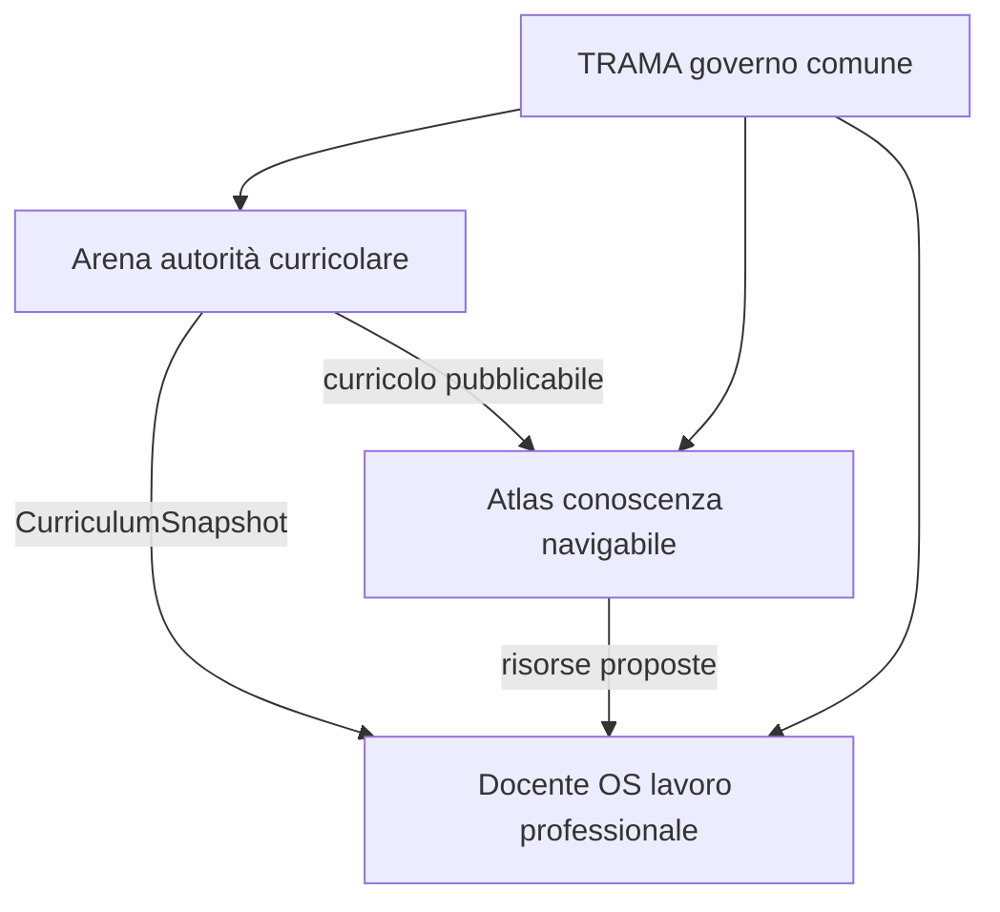

# Architettura dell ecosistema

## Componenti

### Arena

Sistema di governo curricolare. Determina versione, applicabilità, fonti, stato approvativo e trasferimenti autorevoli.

### Atlas

Biblioteca semantica e visuale. Rende navigabili curricolo, relazioni, percorsi e oggetti di apprendimento. Non approva il curricolo.

### Docente OS

Spazio professionale personale. Organizza classi, orario, piani, preparazione, lezioni, adattamenti e riflessione.

### TRAMA

Livello di governo comune. Non conserva curricolo, materiali o dati personali; definisce contratti e decisioni trasversali.

## Relazioni

La relazione diretta Arena verso Docente OS è necessaria. Atlas non è un passaggio obbligatorio né una seconda fonte curricolare.

## Proprietà architetturali

- prodotti distinti, non microinterfacce fuse;
- fonti autorevoli esplicite;
- trasferimenti minimi e versionati;
- proposta separata da adozione;
- dettagli tecnici consultabili ma subordinati alla lettura professionale;
- nessuna scrittura autonoma tra prodotti.

