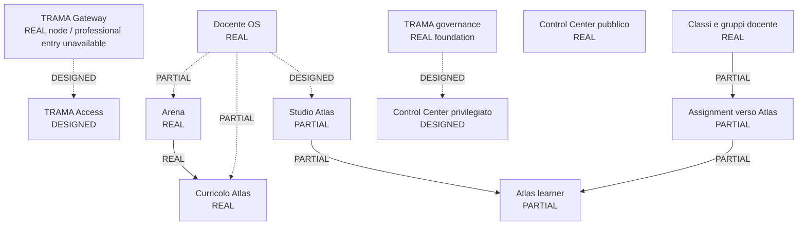
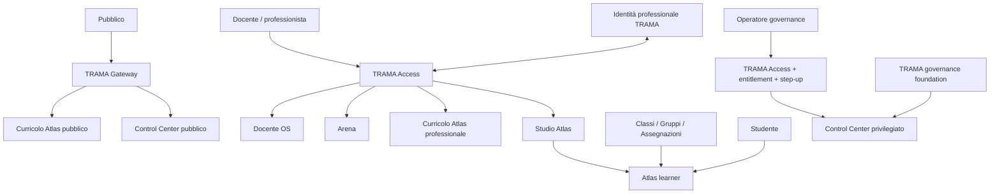

# TRAMA Ecosystem State Map v0.2 — Evidence Record

**Data:** 2026-10-10  
**Scopo:** registrazione persistente della state map AS-IS / TARGET approvata.  
**Autorità:** evidenza visuale derivata per ACCESS-01; non è la fonte autorevole delle transizioni di stato.

## Gerarchia delle fonti

1. `docs/superpowers/specs/2026-10-10-trama-access-01-ecosystem-access-architecture-design.md` — autorità architetturale.
2. `governance/access/trama-ecosystem-state-v0.2.json` — autorità machine-readable sullo stato di nodi e flussi.
3. `docs/evidence/access-01/trama-ecosystem-state-assessment-v0.2.md` — interpretazione analitica e razionale.
4. Infografica visuale — vista derivata per comprensione umana.

Un colore o una freccia nell'infografica non promuove da solo un nodo o flusso. La promozione richiede prima evidenza exact-head e modifica dello stato machine-readable.

## Asset visuali registrati

### PNG master

- filename: `TRAMA-ecosystem-state-map-v0.2.png`
- size: 1448 × 1086 px
- SHA-256: `da904967e775a9417626a34835af1687ec0cbd380b127df3b392fbb29cba5340`
- persistent Library path: `/TRAMA/ACCESS-01/TRAMA-ecosystem-state-map-v0.2.png`

### WebP distribution copy

- filename: `TRAMA-ecosystem-state-map-v0.2.webp`
- size: 1200 × 900 px
- SHA-256: `1256c37487f2e3f39c9c4958de55681fac7df634718b09e01712aac515b5d6d6`
- persistent Library path: `/TRAMA/ACCESS-01/TRAMA-ecosystem-state-map-v0.2.webp`

## Interpretazione canonica

L'infografica separa deliberatamente:

- **AS-IS — stato reale oggi**: nodi reali, flussi parziali e layer connettivo mancante;
- **TARGET — architettura ACCESS-01**: relazioni e user flow target approvati;
- stato dei nodi da stato dei flussi;
- piani pubblico, professionale, learner e governance;
- Arena → Curricolo Atlas da Studio Atlas → Atlas learner;
- Control Center pubblico da Control Center privilegiato;
- materiali/classi locali dai contratti cross-product.

## Regola di integrità

Se la visuale viene rigenerata o modificata, incrementare la versione oppure sostituire il digest registrato soltanto tramite aggiornamento reviewato di stato/evidenza. Non sovrascrivere silenziosamente il significato della v0.2.

## Mermaid fallback — AS-IS core

## Mermaid fallback — TARGET core

