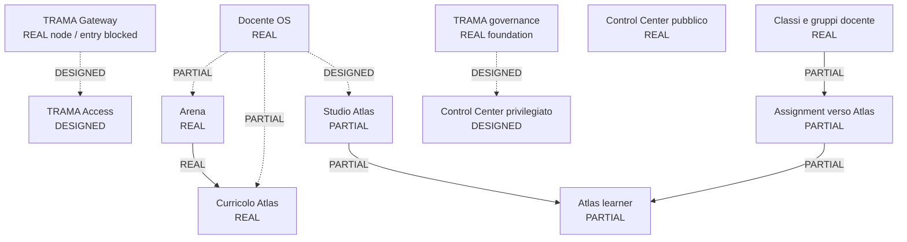
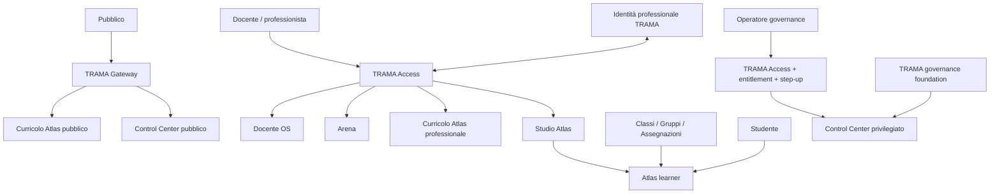

# TRAMA Ecosystem State Map v0.2 — Evidence Record

**Date:** 2026-10-10  
**Purpose:** Persistent registration of the approved AS-IS / TARGET ecosystem state map.  
**Authority:** Derived visual evidence for ACCESS-01; not the source of truth for state transitions.

## Source hierarchy

1. `docs/superpowers/specs/2026-10-10-trama-access-01-ecosystem-access-architecture.md` — architecture authority.
2. `governance/access/trama-ecosystem-state-v0.2.json` — machine-readable node/flow state authority.
3. `docs/evidence/access-01/trama-ecosystem-state-assessment-v0.2.md` — analytical interpretation and rationale.
4. Visual infographic — derived view for human comprehension.

A visual color or arrow does not promote a node/flow state by itself. State promotion requires exact-head evidence and a machine-readable state change first.

## Registered visual assets

### PNG master

- filename: `TRAMA-ecosystem-state-map-v0.2.png`
- size: 1448 × 1086 px
- SHA-256: `da904967e775a9417626a34835af1687ec0cbd380b127df3b392fbb29cba5340`
- persistent Library path: `/TRAMA/ACCESS-01/TRAMA-ecosystem-state-map-v0.2.png`

### WebP distribution copy

- filename: `TRAMA-ecosystem-state-map-v0.2.webp`
- size: 1200 × 900 px
- SHA-256: `1256c37487f2e3f39c9c4958de55681fac7df634718b09e01712aac515b5d6d6`
- persistent Library path: `/TRAMA/ACCESS-01/TRAMA-ecosystem-state-map-v0.2.webp`

## Canonical visual interpretation

The infographic deliberately separates:

- **AS-IS — stato reale oggi**: real nodes, partial flows and missing connective layer;
- **TARGET — architettura ACCESS-01**: approved target relationships and user flows;
- **node status** from **flow status**;
- public, professional, learner and governance planes;
- Arena → Curricolo Atlas from Studio Atlas → Atlas learner;
- public Control Center from privileged Control Center;
- product-local materials/classes from cross-product contracts.

## Integrity note

If the visual is regenerated or edited, increment the visual version or replace the registered digest only through a reviewed state/evidence update. Do not silently overwrite the meaning of v0.2.

## Mermaid fallback — AS-IS core

## Mermaid fallback — TARGET core

