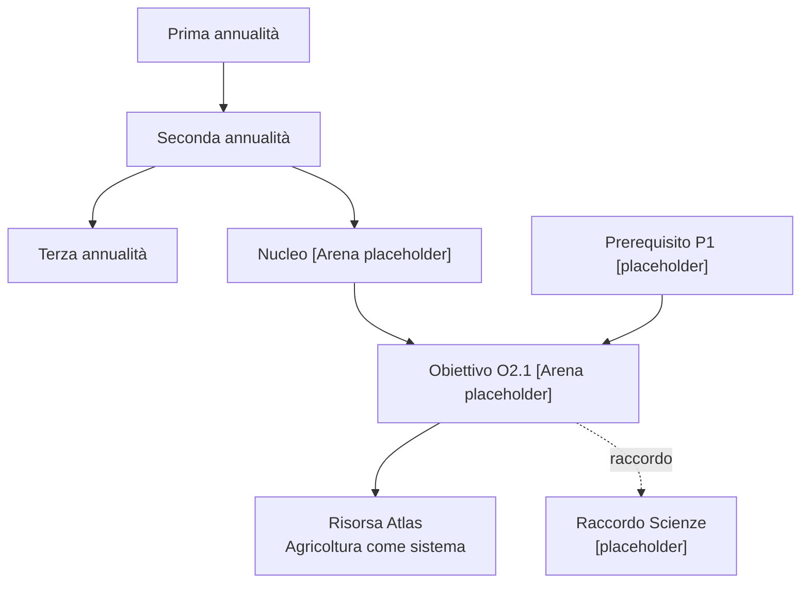
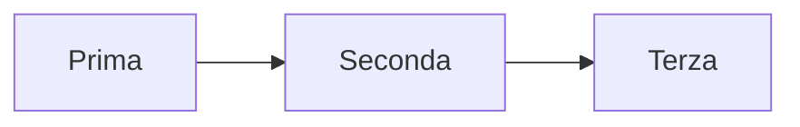
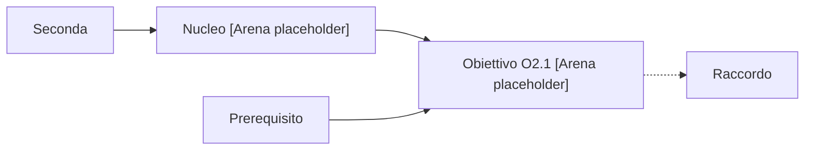
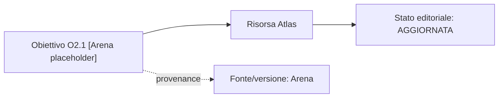

# R3-F0/S3 — Prototype Artifacts

**Stato:** PROTOTYPE_EVIDENCE / NO_RUNTIME  
**Caso:** Tecnologia — seconda annualità — “Agricoltura come sistema tecnologico”  
**Nota di autorità:** i nodi curricolari marcati `[Arena placeholder]` sono segnaposto di prototipo e non formulazioni curricolari autorevoli. In un prototipo alimentato da dati reali devono essere sostituiti con etichette e stato provenienti da Arena.

## A. Journey pubblico/famiglia — wireframe

```text
ATLAS
Curricolo | Percorsi | Risorse | Esplora

Tecnologia
[ Prima ] [ Seconda • selezionata ] [ Terza ]

Progressione
Prima
  ↓
Seconda  ← sei qui
  ↓
Terza

Seconda
└─ Nucleo [Arena placeholder]
   ├─ Obiettivo O2.1 [Arena placeholder]
   │  ├─ Evidenza didattica non individuale
   │  └─ Risorsa Atlas: “Agricoltura come sistema”
   └─ Obiettivo O2.2 [Arena placeholder]

[ Mostra fonte e versione ▾ ]
Fonte curricolare: Arena
Versione: disponibile dalla fonte
```

### Cosa dimostra

- gerarchia prima delle card;
- progressione annuale leggibile;
- risorsa Atlas distinta dall'obiettivo;
- provenance sotto progressive disclosure;
- nessun identificativo tecnico nella lettura primaria.

## B. Journey studente — wireframe

```text
ATLAS — Impara
Seconda · Tecnologia

[ Lezioni ] [ Obiettivi ]

LEZIONI
1. Agricoltura come sistema tecnologico
   Materiale: schema visuale
   Materiale: sintesi
   Materiale: attività

Passa a “Obiettivi” →
```

Vista equivalente:

```text
ATLAS — Impara
Seconda · Tecnologia

[ Lezioni ] [ Obiettivi • selezionato ]

OBIETTIVI
Obiettivo O2.1 [Arena placeholder]
└─ Lezione: Agricoltura come sistema tecnologico
   ├─ Schema visuale
   ├─ Sintesi
   └─ Attività
```

### Cosa dimostra

- stesso dominio informativo, due prospettive;
- nessuna duplicazione autorevole dell'obiettivo;
- nessun account, profilo o identificatore studente;
- nessun dato individuale.

## C. Journey docente — wireframe

```text
ATLAS — Esplora curricolo

Tecnologia > Seconda > Obiettivo O2.1 [Arena placeholder]

Posizione nella progressione
Prima → Seconda → Terza

Prerequisiti
- Relazione P1 [placeholder]

Raccordi
- Scienze: relazione interdisciplinare [placeholder]

Risorse Atlas
- Agricoltura come sistema — PUBBLICATA
- Schema sistema agricolo — AGGIORNATA

[ Fonte e versione ▾ ]

Nota:
Le decisioni professionali “riutilizza / adatta / sostituisci / escludi”
appartengono a Docente OS e non sono azioni operative in questa superficie.
```

## D. POC mappa 2D — panoramica

La forma seguente è una **mappa concettuale di prototipo**, non un grafo curricolare autorevole.



### Equivalente elenco

1. Seconda annualità
   1. Nucleo `[Arena placeholder]`
      1. Obiettivo O2.1 `[Arena placeholder]`
         - prerequisito: P1 `[placeholder]`
         - risorsa Atlas: Agricoltura come sistema
         - raccordo interdisciplinare: Scienze `[placeholder]`

L'elenco contiene le stesse relazioni essenziali della visuale.

## E. Semantic zoom — tre livelli statici

### Livello 1 — panoramica



### Livello 2 — relazioni



### Livello 3 — dettaglio



### Regola dimostrata

Tra i tre livelli cambiano quantità di dettaglio e densità. Non cambiano:

- identità logica del nodo;
- autorità;
- stato;
- significato delle relazioni.

## F. Stress test dei tre domini di stato

Scenario unico:

```text
Obiettivo O2.1
CurricularStatus: CORRENTE
Fonte: Arena

Risorsa Atlas: “Schema sistema agricolo”
EditorialStatus: RITIRATA

Risorse correlate
UIFeedbackStatus: ERRORE TEMPORANEO
“Non è stato possibile caricare 2 risorse correlate. Riprova.”
```

### Variante senza colore

- `CORRENTE` — testo + icona/forma di stato curricolare;
- `RITIRATA` — testo + segno editoriale persistente;
- `ERRORE TEMPORANEO` — messaggio contestuale con azione di recupero.

### Vincoli

- `CORRENTE` proviene dalla fonte Arena; Atlas non lo inferisce;
- `RITIRATA` appartiene allo stato editoriale Atlas;
- `ERRORE TEMPORANEO` non modifica né lo stato curricolare né quello editoriale.

## G. Keyboard walkthrough

### Pubblico/famiglia

1. Tab → navigazione primaria.
2. Tab → selettore annualità.
3. Tab → outline/obiettivi.
4. Enter/Space → disclosure fonte/versione.
5. Tab → risorsa Atlas.

### Studente

1. Tab → tablist Lezioni/Obiettivi.
2. Frecce → cambio focus fra tab.
3. Enter/Space se attivazione manuale.
4. Tab → contenuto del pannello.
5. Tab → materiale.

### Docente

1. Tab → breadcrumb.
2. Tab → outline.
3. Tab → relazioni.
4. Tab → risorse.
5. Enter/Space → provenance disclosure.

### Mappa 2D

La visuale non è il percorso tastiera primario. Il comando **Visuale | Elenco** porta all'outline equivalente; il contenuto essenziale è navigabile in ordine lineare.

## H. Reflow e mobile

A larghezza mobile:

- una sola colonna;
- pannello contestuale dopo il contenuto principale;
- mappa 2D sostituita/affiancata dall'elenco equivalente;
- nessun contenuto essenziale in tooltip;
- filtri e provenance in disclosure;
- nessun controllo dipende da hover.

## I. Test di leggibilità metadata

Campione:

```text
Fonte: Arena · versione curricolare disponibile dalla fonte
Stato editoriale Atlas: aggiornato
Licenza: informazioni disponibili
```

Verifiche richieste:

- Android portrait;
- browser zoom;
- desktop;
- LIM;
- testo lungo italiano;
- nessun clipping;
- nessuna abbreviazione che elimini il significato.

Se `type.metadata = 0.8125rem` risulta poco leggibile nel test umano, il token va aumentato prima dell'uscita di R3-F0.

## L. Evidence checklist

- [x] wireframe pubblico/famiglia;
- [x] wireframe studente;
- [x] wireframe docente;
- [x] POC 2D statico;
- [x] equivalente elenco;
- [x] semantic zoom a tre livelli;
- [x] stress test stato curricolare/editoriale/UI;
- [x] walkthrough tastiera;
- [x] regole reflow/mobile;
- [x] test plan metadata;
- [ ] verifica umana visuale su Android;
- [ ] verifica umana visuale desktop;
- [ ] verifica umana visuale LIM;
- [ ] test automatico di contrasto/reflow su prototipo implementato — non applicabile finché resta NO_RUNTIME;
- [ ] HUMAN EXACT-HEAD REVIEW S3.
