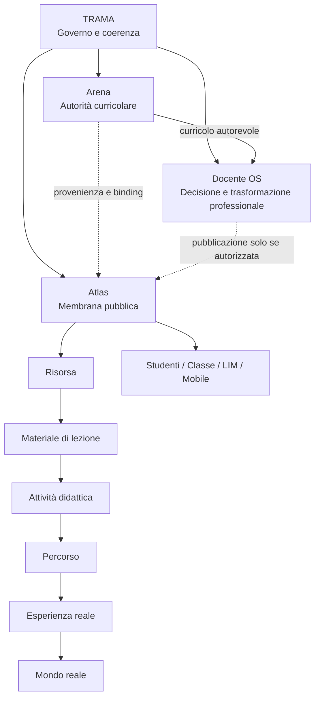

# TRAMA — Dossier dell’ecosistema

**Versione:** 23 settembre 2026  
**Stato:** SYNTHESIS BASELINE / DOCUMENTATION-ONLY / NON NORMATIVE / NON AUTORIZZA NUOVI RUNTIME  
**Scopo:** sostenere nel tempo l’ecosistema TRAMA con una base condivisa di significato, architettura, linguaggio, documentazione e asset.

## 1. Tesi centrale

TRAMA non è una quarta applicazione e non è un contenitore generico. È il sistema di governo, coerenza e continuità che permette a tre domini differenti — Arena, Docente OS e Atlas — di concorrere a una stessa trasformazione educativa senza confondere autorità, responsabilità o pubblico.

La formula sintetica è:

> **TRAMA è la grammatica che mantiene coerente la trasformazione del curricolo: Arena ne custodisce l’autorità, Docente OS ne rende possibile l’interpretazione professionale, Atlas lo apre alla comunità scolastica e all’esperienza reale.**

L’ecosistema non è progettato come una pipeline automatica. È un insieme di relazioni governate, con punti di controllo umani e responsabilità distribuite.

## 2. Perché esiste TRAMA

Il problema che TRAMA affronta non è la mancanza di un’altra piattaforma. È la frammentazione tra:
- curricolo approvato e documentato;
- lavoro professionale quotidiano del docente;
- materiali e attività che rendono il curricolo concreto;
- accesso pubblico e comprensibile per studenti e famiglie;
- progressione verticale dell’istituto;
- memoria organizzativa e verificabilità delle decisioni.

TRAMA tiene insieme questi livelli senza fonderli. La coerenza deriva da contratti, provenienza, versioni, manifesti, ricevute, gate umani e regole di pubblicazione.

## 3. La metafora atomica

La metafora atomica è il modello concettuale dell’ecosistema, non una decorazione grafica.

### 3.1 Il nucleo TRAMA

Il nucleo rappresenta ciò che deve rimanere stabile quando i singoli prodotti evolvono:
- principi di governo;
- confini di autorità;
- contratti tra domini;
- regole di provenienza;
- privacy e minimizzazione;
- accessibilità;
- feedback percepibile;
- revisione umana;
- coerenza semantica e documentale.

TRAMA non sostituisce i prodotti. Stabilisce la grammatica che permette loro di cooperare.

### 3.2 Arena — autorità curricolare

Arena è la fonte autorevole del curricolo. Custodisce struttura, provenienza, versione, stato di approvazione e raccordi del curricolo verticale d’istituto.

Arena non deve diventare il luogo operativo quotidiano del docente né il portale pubblico dello studente. La sua funzione è dare certezza a ciò che l’ecosistema considera curriculum valido.

### 3.3 Docente OS — trasformazione professionale

Docente OS è il luogo in cui il curricolo incontra il contesto reale della classe e la decisione professionale del docente.

Il docente deve poter:
- accettare una proposta;
- modificarla;
- sostituirla;
- escluderla;
- integrare materiali;
- preparare e registrare la lezione;
- mantenere controllo sulle decisioni rilevanti.

Il principio teacher-first non è una scelta estetica: è un vincolo architetturale e pedagogico.

### 3.4 Atlas — membrana pubblica

Atlas è la membrana pubblica dell’ecosistema: rende il curricolo visibile, navigabile e praticabile.

La sua apertura è rivolta a:
- studenti;
- classi;
- famiglie;
- LIM;
- smartphone e tablet;
- contesti domestici;
- territorio e mondo reale.

Atlas non richiede di trasformare lo studente in un account. La selezione di classe e disciplina è contesto pubblico, non identità.

## Mappa sintetica dell’ecosistema

La linea tratteggiata Docente OS → Atlas indica una possibilità governata, non un runtime attualmente autorizzato.

## 4. Significato delle orbite

Le orbite indicano trasformazioni e relazioni governate. Non indicano automatismi incontrollati.

Il percorso semantico fondamentale è:

**curricolo → comprensione → preparazione → lezione → materiale → attività → esperienza**

Ogni passaggio conserva la provenienza e la possibilità di controllo umano. La continuità non implica fusione dei sistemi.

## 5. Modello dei contenuti pubblici Atlas

Nel **target di prodotto/design Atlas V2** la specifica integrata distingue quattro livelli. Questa classificazione descrive il modello verso cui evolve la superficie pubblica; non implica che tutti i livelli siano già disponibili in runtime.

### L1 — Risorsa
Unità elementare: immagine, PDF, slide, video, infografica, link, documento o altro oggetto fruibile.

### L2 — Materiale di lezione
Una o più risorse contestualizzate rispetto a classe, disciplina, lezione e obiettivi.

### L3 — Attività didattica
Una esperienza guidata con stimolo, sequenza, interazioni, eventuali fasi fuori dallo schermo, feedback locale e riflessione finale.

### L4 — Percorso
Una sequenza coerente di attività e materiali collegata a progressione, concetti, obiettivi e annualità.

Questa gerarchia è il riferimento di design per evitare che Atlas evolva come semplice biblioteca di file.

## 6. Fotografia di stato al 23 settembre 2026

> Questa sezione è una fotografia storica. Per lo stato corrente e per le priorità operative fanno fede rispettivamente [`STATUS.md`](../../STATUS.md) e il [Piano operativo atomico](../strategy/atomic-operating-plan-2026-09-22.md).

- **Arena:** operativa come authority curricolare.
- **Docente OS:** operativo nel proprio dominio, con baseline, preparazione e TeachingSession.
- **Atlas R3-F0/S3-V2:** attivo; foundation, curricolo verticale, materiali pubblici di base ed Esplora relazionale integrati; F3–F5 restano il fronte di completamento.
- **ECO-02/P1:** pilota controllato attivo; il collaudo umano integrato resta gate reale.
- **Risorsa Atlas reale:** la “Mappa del sistema agricolo” per Tecnologia 2C è stata pubblicata come risorsa pubblica Atlas.
- **Runtime Docente OS → Atlas:** non autorizzato.
- **DOS-A1:** deferred.
- **Officina materiali:** architettura prevista, runtime non autorizzato.
- **Atlas Mockup V2:** la specifica `docs/design/atlas-mockup-v2-vision-alignment.md` è integrata su `main` tramite PR #61 (merge `2077386a7deea9c8143c9ab1c37bbcc27e562bf8`); formalizza il passaggio da struttura a trasformazione educativa e resta una direzione di design, non un’autorizzazione runtime.

## 7. La trasformazione educativa come principio di prodotto

La UI deve mostrare non soltanto dove si trovano le informazioni, ma come esse cambiano funzione lungo il percorso.

Un obiettivo curricolare può diventare:
- riferimento professionale;
- intenzione didattica;
- lezione;
- materiale;
- attività;
- percorso;
- esperienza concreta.

L’utente deve poter riconoscere il contesto curricolare senza essere costretto a conoscere l’architettura tecnica sottostante.

## 8. Visione dell’esperienza Atlas

Nella specifica Atlas Mockup V2 integrata, tre ingressi pubblici devono restare riconoscibili:
1. **Esplora il curricolo**
2. **Vai ai materiali della tua classe**
3. **Scopri percorsi e attività**

Il journey principale dei materiali è:

**classe → disciplina → lezione → materiali/attività**

Esplora deve rendere visibile la rete curricolare e i raccordi. Materiali deve organizzare contenuti per funzione didattica. Attività deve diventare un player di esperienza, anche con passaggi OFFSCREEN. Percorsi deve mostrare trasformazione nel tempo.

## 9. Mobile e LIM

Mobile non è desktop ridotto. La progettazione deve privilegiare una decisione primaria per schermata, contenuti lineari, filtri compatti e nessuna dipendenza da hover.

La LIM non è un monitor grande. Deve favorire una idea o uno step principale per schermata, controlli grandi, leggibilità a distanza, discussione e attività collettive.

## 10. Privacy, dati e identità

Principio canonico: Atlas è privacy-first.

Non sono parte della vision pubblica:
- login obbligatorio dello studente;
- profilo personale;
- ranking;
- cronologia individuale server-side;
- tracciamento comportamentale individuale;
- dashboard personali di rendimento.

Gli eventuali stati locali delle attività devono essere minimizzati, comprensibili e cancellabili.

## 11. Il docente come decisore

Ogni proposta generata o ricevuta deve rimanere distinguibile da una decisione del docente.

La tecnologia può:
- proporre;
- organizzare;
- mettere in relazione;
- verificare vincoli;
- ridurre attrito;
- produrre feedback.

Non deve attribuirsi implicitamente l’autorità professionale o istituzionale del docente e della scuola.

## 12. No silent write

Ogni operazione persistente importante deve avere feedback percepibile. Il problema non è soltanto tecnico: una scrittura invisibile spezza la fiducia e rende opaca la responsabilità.

Per questo TRAMA assume come regola trasversale:
- stato visibile;
- conferma riconoscibile;
- errore comprensibile;
- possibilità di recupero quando applicabile;
- nessuna azione critica affidata soltanto a un toast effimero.

## 13. Evoluzione possibile

La metafora atomica consente di descrivere la crescita senza confondere futuro e presente.

### F3 — Materiali + Risorse
Passare dal file isolato al materiale contestualizzato per lezione e funzione didattica.

### F4 — Mobile + LIM
Validare esperienze pubbliche progettate specificamente per smartphone/tablet e classe.

### F5 — Exit
Verificare coerenza complessiva, accessibilità, chiarezza delle authority e continuità curricolo→esperienza.

### R3-P2 — Curricolo pubblico
Rendere il curricolo un patrimonio pubblico navigabile, senza duplicare l’autorità di Arena.

### R3-P3 — Student Learning Hub
Offrire un accesso centrato sulla fruizione dello studente senza richiedere un’identità digitale personale.

### R3-P5 — Smart Navigation
Rendere più intelligente la scoperta di obiettivi, raccordi, materiali, attività e percorsi.

### R3-P6 — Curriculum Health
Dare visibilità aggregata su copertura, coerenza e qualità del curricolo, senza trasformare la misurazione in sorveglianza individuale.

## 14. Invarianti e direzioni di design

### Invarianti di governance
1. Arena resta l’autorità curricolare.
2. Il docente resta il decisore professionale.
3. Atlas resta privacy-first e non richiede account o tracking individuale dello studente.
4. Nessun runtime cross-product viene autorizzato implicitamente da un mockup o da un documento di vision.
5. Provenienza, versione e confini di authority devono rimanere verificabili.
6. Le relazioni tra prodotti devono rimanere governate; pubblicazione, adozione e approvazione restano concetti distinti.
7. La documentazione deve distinguere sempre stato reale, direzione approvata e ipotesi futura.

### Direzioni di prodotto/design già integrate
- mobile e LIM sono superfici da progettare specificamente, non semplici riduzioni del desktop;
- le attività Atlas possono includere passaggi fuori dallo schermo e nel mondo reale;
- accessibilità e feedback percepibile sono requisiti trasversali dell’esperienza;
- il target Atlas evolve da struttura navigabile verso materiali, attività e percorsi, senza implicare che ogni livello sia già implementato.

## 15. Sistema documentale di TRAMA

Per sostenere l’ecosistema nel tempo, la documentazione deve essere organizzata in cinque famiglie.

### A. Vision e filosofia
Documenti che spiegano perché esiste TRAMA, quale idea di scuola incorpora e quale trasformazione intende rendere possibile.

### B. Governance e authority
ADR, contratti cross-product, regole di provenienza, manifesti, ricevute, gate umani e criteri di autorizzazione.

### C. Prodotto e design
Design system, specifiche di Atlas, Docente OS e Arena, journey, pattern di interazione, mobile, LIM, accessibilità.

### D. Stato e roadmap
STATUS, piani operativi atomici, milestone, dipendenze, gate e stato delle PR.

### E. Asset narrativi e visuali
Metafora atomica, mappe, diagrammi architetturali, tavole di flusso, immagini didattiche e materiali dimostrativi.

Queste famiglie devono collegarsi fra loro e non produrre copie concorrenti della stessa decisione.

## 16. Sistema degli asset

Gli asset devono avere una funzione precisa.

- **Infografica istituzionale:** racconta identità e ruolo dei domini.
- **Schema architetturale:** mostra authority, flussi consentiti e gate.
- **Mappa di prodotto:** mostra superfici, journey e contenuti.
- **Roadmap visuale:** distingue ciò che esiste da ciò che è in sviluppo o pianificato.
- **Mockup esperienziale:** rappresenta come l’utente vivrà una superficie futura.
- **Esempi reali:** materiali, attività e percorsi usati come casi di prova.

Un asset non deve sostituire la fonte normativa o la specifica tecnica; deve renderla più comprensibile.

## 17. Implicazioni per lo sviluppo

La metafora produce criteri concreti:
- non duplicare dati curricolari autorevoli;
- mantenere binding ad Arena;
- separare proposta, adozione e pubblicazione;
- differenziare L1–L4 nella UI;
- modellare lezione e attività come contesti, non cartelle;
- mantenere equivalenza accessibile per mappe e visualizzazioni;
- progettare offline e stato locale senza account;
- evitare cross-product write finché non esplicitamente autorizzati.

## 18. Acceptance criteria della coerenza TRAMA

Una nuova funzione, schermata o asset è coerente quando:
- è chiaro quale dominio possiede l’autorità;
- non induce l’utente a credere che una proposta sia una decisione;
- conserva provenienza e contesto;
- evita profilazione non necessaria;
- rende percepibili le azioni persistenti;
- non crea un canale parallelo non governato;
- supporta la continuità curricolo→esperienza;
- resta comprensibile anche senza conoscere il lessico interno di progetto.

## 19. Lessico canonico

**TRAMA:** governo e grammatica dell’ecosistema.  
**Arena:** autorità curricolare.  
**Docente OS:** workspace e decision surface professionale.  
**Atlas:** membrana pubblica, navigazione e fruizione.  
**Risorsa:** unità elementare di contenuto.  
**Materiale di lezione:** risorsa contestualizzata nella lezione.  
**Attività didattica:** esperienza guidata.  
**Percorso:** sequenza coerente nel tempo.  
**Provenienza:** informazione che permette di ricostruire origine e autorità.  
**Gate umano:** passaggio che richiede decisione o validazione umana esplicita.  
**RUNTIME_DEFERRED:** funzionalità non autorizzata all’esecuzione operativa.  
**No silent write:** nessuna scrittura significativa senza feedback percepibile.

## 20. Uso di questo dossier

Questa baseline deve fungere da **indice di orientamento e sintesi** per:
- nuove specifiche;
- onboarding di collaboratori e agenti;
- presentazioni a dirigenti, docenti e stakeholder;
- verifiche di coerenza del prodotto;
- review di design;
- redazione di documenti istituzionali;
- scelta e produzione dei futuri asset;
- ricostruzione della filosofia di progetto nel tempo.

Non sostituisce ADR, contratti tecnici, `STATUS.md`, piano operativo atomico, specifiche integrate o filosofia in sviluppo. Li collega in una narrazione coerente e rinvia sempre alla fonte primaria.

## 21. Formula finale

TRAMA non tenta di automatizzare la scuola. Tenta di **rendere coerente, visibile e praticabile il percorso con cui una comunità scolastica trasforma un curricolo autorevole in esperienza educativa**, mantenendo distinti autorità istituzionale, professionalità docente e accesso pubblico.

## 22. Registro documentale della baseline

| Oggetto | Ruolo | Stato al 23/09/2026 |
| --- | --- | --- |
| `docs/design/atlas-mockup-v2-vision-alignment.md` | Specifica di design Atlas V2 | **INTEGRATA** via PR #61 |
| `docs/vision/TRAMA-ECOSYSTEM-BASELINE-2026-09-23.md` | Baseline concettuale versionata | **IN REVIEW** via PR #62 |
| Dossier ufficiale TRAMA | Documento narrativo e architetturale esteso | **ASSET CONTROLLATO** |
| Infografica “TRAMA: Scuola in movimento” | Metafora atomica istituzionale | **ASSET BASELINE** |
| Tavola tecnica TRAMA | Authority, flussi, gate e L1–L4 | **ASSET COMPLEMENTARE** |

### Regola di precedenza

1. **ADR e contratti approvati** — decisioni normative e confini di authority.
2. **`STATUS.md`** — stato corrente verificato.
3. **Piano operativo atomico** — priorità e sequenza operativa.
4. **Specifiche integrate** — comportamento del relativo dominio o superficie.
5. **Filosofia in sviluppo** — razionale, frasi-cardine e ipotesi non normative.
6. **Questa baseline** — sintesi e indice trasversale.
7. **Dossier e asset visuali** — comunicazione e spiegazione.

In caso di divergenza, la fonte di livello superiore prevale. La baseline non può introdurre una decisione, uno stato o una priorità non presenti nella fonte primaria.

## 23. Regola per i futuri asset

Ogni nuovo asset TRAMA deve dichiarare:
- data/versione;
- stato: reale, in sviluppo o ipotesi;
- dominio responsabile;
- authority di riferimento;
- stato di autorizzazione runtime;
- relazione con la fonte canonica.

In assenza di tali dati, l’asset è da considerare **illustrativo** e non fonte decisionale.

## 24. Relazione con le fonti preesistenti

Questa baseline non sostituisce:
- [Filosofia in sviluppo](./philosophy-in-development.md), che conserva il **perché** e le ipotesi;
- [Strategia di prodotto](./product-strategy.md), che definisce posizionamento e promessa di prodotto;
- [Evoluzione della metafora atomica](../strategy/atomic-metaphor-evolution-2026-09-23.md), che governa la **semantica visuale** della metafora;
- [Piano operativo atomico](../strategy/atomic-operating-plan-2026-09-22.md), che governa la **sequenza operativa**;
- [STATUS.md](../../STATUS.md), che governa lo **stato corrente**.

La funzione della baseline è rendere queste fonti attraversabili come un sistema unico senza duplicarne l’autorità.
